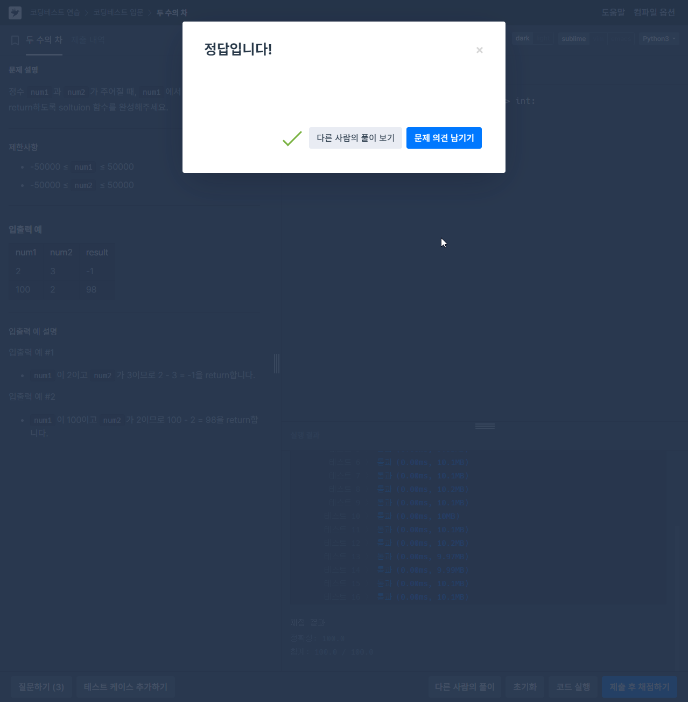

# 두 수의 차
https://school.programmers.co.kr/learn/courses/30/lessons/120803?language=python3

# 풀이
```python
def solution(num1: int, num2: int) -> int:
    answer = num1 - num2
    return answer

# solution = lambda num1, num2: num1 - num2

if __name__ == '__main__':
    print(solution(1, 2))
```

# 인증
